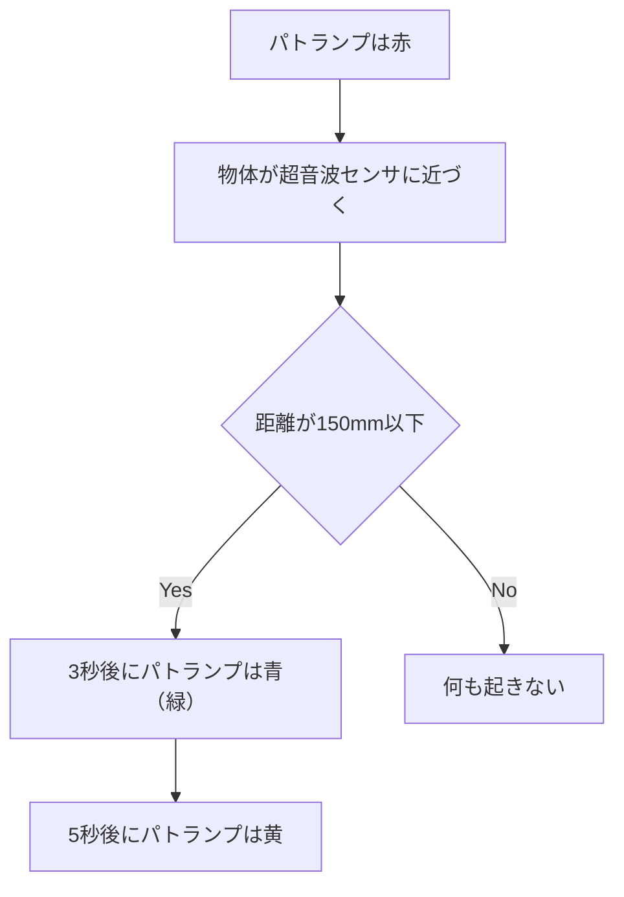

# 距離に応じてライトの色を変えてみよう

### 感知式信号機  
車があまり通らない場所では、車がいることを超音波センサで感知してから信号機のライトを制御する仕組みになっています。    
停止線より手前で止まりすぎると信号が変わらないということも...  

  

### このような仕組みを Node-RED 作ってみましょう  
超音波センサの検知する物体が一定の距離以上近づくと、ライトの色が変わる、という仕組みです。  



### 1. obniz Board での配線

#### インジケーター: パトランプ  
> [!WARNING]
> **極性(+ -)があるため、接続に間違いがないか注意**


| 電子パーツの脚         | obnizピン         |
|--------------|---------------|
| GND  | obnizの3番    |
| G  | obnizの4番    |
| Y  | obnizの5番    |
| R  | obnizの6番    |

#### センサー: 超音波距離センサー


| 電子パーツの脚         | obnizピン         |
|--------------|---------------|
| GND  | obnizの8番    |
| Edho  | obnizの9番    |
| Trig  | obnizの10番    |
| Vcc  | obnizの11番    |

> [!NOTE]
> obniz Board がごちゃごちゃしてきてますが問題ありません
>   
> ※パトランプゲットしたら画像入れる
  
### 2. 使うノードとつなぎ方
    
- `obniz repeatノード`
- `switchノード`
- `obniz-functionノード`
- `debugノード`


  

### 3. 初期化処理コードの編集
  
```js
obnizParts.light = obniz.wired("Keyestudio_TrafficLight", {gnd:3, green:4, yellow:5, red:6});
obnizParts.hcsr04 = obniz.wired("HC-SR04",{ gnd:8, echo:9, trigger:10, vcc:11 }); //8,9,10,11番にピンを割り当てる
```
  
### 4. 各ノードの設定方法

- `obniz repeatノード`のコード

```js
msg.payload = await obnizParts.hcsr04.measureWait(); // センサーから取得した値をmsg.payloadに格納

return msg; //msg.payloadを出力
```

- `switchノード`
  
>  payload が150mm より小さいか150mm以上か、という条件をつくります。  
> 
  
> データの型を数値にするのをお忘れなく！  
> 

  
- `changeノード`   
payloadが150mmより小さければ `green` という値を渡すようにします。  


同様に、150mm以上なら `red` にします。   
この色の文字列をパトランプが受け取ることで色を変えることができます。  

- Green の `obniz-functionノード`のコード

```js
obniz.wait(3000);
obnizParts.light.single(msg.payload); //payloadの文字列がredなら赤、yellowなら黄色、greenなら緑で光らせる
obniz.wait(5000);
light.single("yellow");

return msg;
```

- Red の `obniz-functionノード`のコード

```js
obnizParts.light.single(msg.payload); //payloadの文字列がredなら赤、yellowなら黄色、greenなら緑で光らせる

return msg;
```


### 5. 結果

距離が近づいた時にLEDの色が変われば OK です！

> [!CAUTION]
> **`obniz-close` で停止するのをお忘れなく！**


### 6. そろそろノードが複雑に...  

電子部品を組み合わせると obniz ノードだけでなく条件分岐などもあってノードが複雑になってきます。
実は、このノードを簡単に出し入れすることができます。

> ノードの塊を左クリックで囲んで指定します。指定するとオレンジ色の枠が出ます。
> 

> この状態で右側のハンバーガーメニューから`書き出し`を選びます。
> 

> `選択したフロー`、`インデントなし`、`JSON`を選んで`書き出し`を押すと先ほどのフローがコピーされた状態になります。
> 

中味はこのようなものです。JSON という形式で先ほどのノードが示されています。
```JSON
[{"id":"d82216061e268340","type":"comment","z":"fcf566e83f304c66","name":"感知式信号機","info":"","x":110,"y":740,"wires":[]},{"id":"33c441a240ac24bf","type":"obniz-repeat","z":"fcf566e83f304c66","obniz":"3a214050aa255b4f","name":"","interval":100,"code":"msg.payload = await obnizParts.hcsr04.measureWait(); // センサーから取得した値をmsg.payloadに格納\r\n\r\nreturn msg; //msg.payloadを出力","x":110,"y":800,"wires":[["0475abc22f78c73a"]]},{"id":"0475abc22f78c73a","type":"switch","z":"fcf566e83f304c66","name":"","property":"payload","propertyType":"msg","rules":[{"t":"lt","v":"150","vt":"num"},{"t":"gte","v":"150","vt":"num"}],"checkall":"true","repair":false,"outputs":2,"x":210,"y":860,"wires":[["d868b775d6aebf01"],["d8f182c07e576548"]]},{"id":"076fd1f5459975fe","type":"obniz-function","z":"fcf566e83f304c66","obniz":"3a214050aa255b4f","name":"","code":"\r\nobniz.wait(3000);\r\nobnizParts.light.single(msg.payload); //payloadの文字列がredなら赤、yellowなら黄色、greenなら緑で光らせる\r\nobniz.wait(5000);\r\nlight.single(\"yellow\");\r\n\r\nreturn msg;\r\n","x":560,"y":820,"wires":[["903c0a52d558bfbc"]]},{"id":"903c0a52d558bfbc","type":"debug","z":"fcf566e83f304c66","name":"debug 2","active":true,"tosidebar":true,"console":false,"tostatus":false,"complete":"payload","targetType":"msg","statusVal":"","statusType":"auto","x":740,"y":860,"wires":[]},{"id":"d868b775d6aebf01","type":"change","z":"fcf566e83f304c66","name":"","rules":[{"t":"set","p":"payload","pt":"msg","to":"green","tot":"str"}],"action":"","property":"","from":"","to":"","reg":false,"x":380,"y":820,"wires":[["076fd1f5459975fe"]]},{"id":"d8f182c07e576548","type":"change","z":"fcf566e83f304c66","name":"","rules":[{"t":"set","p":"payload","pt":"msg","to":"red","tot":"str"}],"action":"","property":"","from":"","to":"","reg":false,"x":380,"y":900,"wires":[["d2b1634250baba16"]]},{"id":"d2b1634250baba16","type":"obniz-function","z":"fcf566e83f304c66","obniz":"3a214050aa255b4f","name":"","code":"obnizParts.light.single(msg.payload); //payloadの文字列がredなら赤、yellowなら黄色、greenなら緑で光らせる\r\n\r\nreturn msg;","x":560,"y":900,"wires":[["903c0a52d558bfbc"]]},{"id":"3a214050aa255b4f","type":"obniz","obnizId":"82630676","deviceType":"obnizboard1y","name":"","accessToken":"","autoConnectOnDeploy":true,"code":"obnizParts.light = obniz.wired(\"Keyestudio_TrafficLight\", {gnd:3, green:4, yellow:5, red:6});\r\nobnizParts.hcsr04 = obniz.wired(\"HC-SR04\",{ gnd:8, echo:9, trigger:10, vcc:11 }); //8,9,10,11番にピンを割り当てる"}]
```

では今度は、同じハンバーガーメニューから`読み込み`を選択し、先ほどコピーされた JSON データを貼り付けます。


>  `読み込み`を押すと先ほどと同じノードが出現します。(ポップアップが出るので`コピーを読み込み`を選びます)
> 

##### さて、この JSON 形式のデータを使えると何が嬉しいでしょうか？
  
> [!IMPORTANT]
> そう、生成 AI のプロンプトに入れることができるんですね！！
> この部分は Day2 で触れていくのでお楽しみに！
  
----  
  
[◀ Lesson1に戻る](../)
