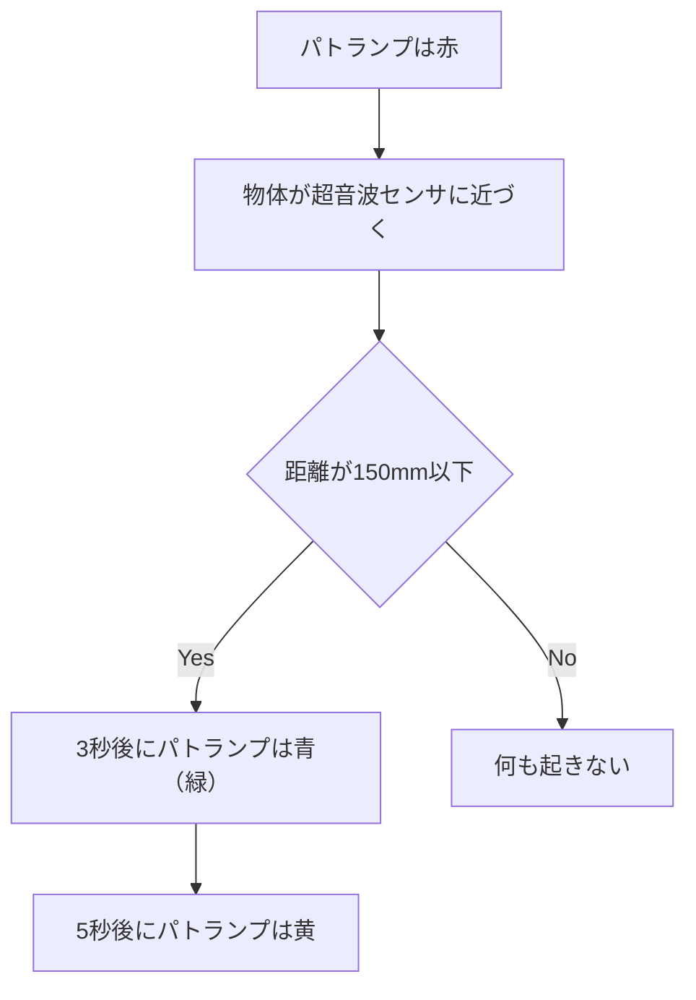

# 距離に応じてライトの色を変えてみよう

このような仕組みを Node-RED 作ってみましょう。  
超音波センサの検知する物体が一定の距離以上近づくと、ライトの色が変わる、という仕組みです。  



### 1. obniz Board での配線

#### インジケーター: パトランプ  
> [!WARNING]
> **極性(+ -)があるため、接続に間違いがないか注意**


| 電子パーツの脚         | obnizピン         |
|--------------|---------------|
| GND  | obnizの3番    |
| G  | obnizの4番    |
| Y  | obnizの5番    |
| R  | obnizの6番    |

#### センサー: 超音波距離センサー


| 電子パーツの脚         | obnizピン         |
|--------------|---------------|
| GND  | obnizの8番    |
| Edho  | obnizの9番    |
| Trig  | obnizの10番    |
| Vcc  | obnizの11番    |

> [!NOTE]
> obniz Board がごちゃごちゃしてきてますが問題ありません
>   
> ※パトランプゲットしたら画像入れる
  
### 2. 使うノードとつなぎ方
    
- `obniz repeatノード`
- `switchノード`
- `obniz-functionノード`
- `debugノード`

画像
  

### 3. 初期化処理コードの編集
  
```js
obnizParts.light = obniz.wired("Keyestudio_TrafficLight", {gnd:3, green:4, yellow:5, red:6});
obnizParts.hcsr04 = obniz.wired("HC-SR04",{ gnd:8, echo:9, trigger:10, vcc:11 }); //8,9,10,11番にピンを割り当てる
```
  
### 4. 各ノードの設定方法

- `obniz repeatノード`のコード

```js
msg.payload = await obnizParts.hcsr04.measureWait(); // センサーから取得した値をmsg.payloadに格納

return msg; //msg.payloadを出力
```

- `switchノード`
payload が150mm 以下 なら

- `changeノード`
payloadが150mm 以下なら `green` という値を設定します。  
それ以外なら `red` にします。   
この値をパトランプが受け取ることで色を変えることができます。  

- `obniz-functionノード`のコード

```js
obniz.wait(3000);
obnizParts.light.single(msg.payload); //payloadの文字列がredなら赤、yellowなら黄色、greenなら緑で光らせる
obniz.wait(5000);
light.single("yellow");

return msg;
```


