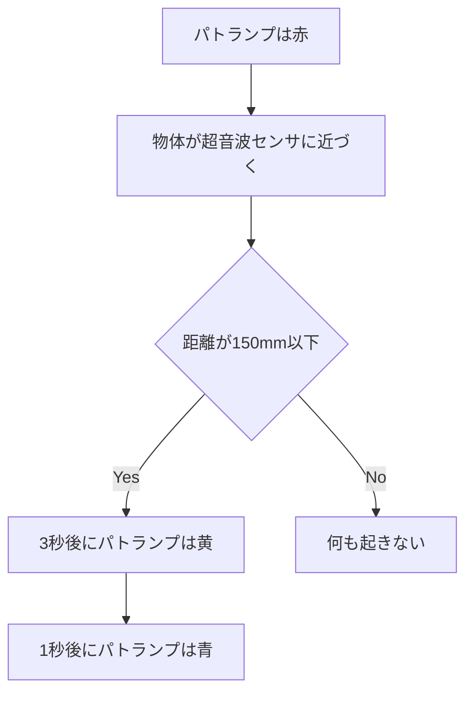

# 距離に応じてライトの色を変えてみよう

このような仕組みを作ってみましょう。超音波センサの検知する物体との距離が一定以上近づくと、ライトの色が変わる、という仕組みです。  

```mermaid

graph TD;
    A[パトランプは赤] --> B[物体が超音波センサに近づく];
    B --> C{距離が150mm以下};
    C --> |Yes| D[3秒後にパトランプは黄];
    D --> E[1秒後にパトランプは青];
    C --> |No| E\F[何も起きない];

```

